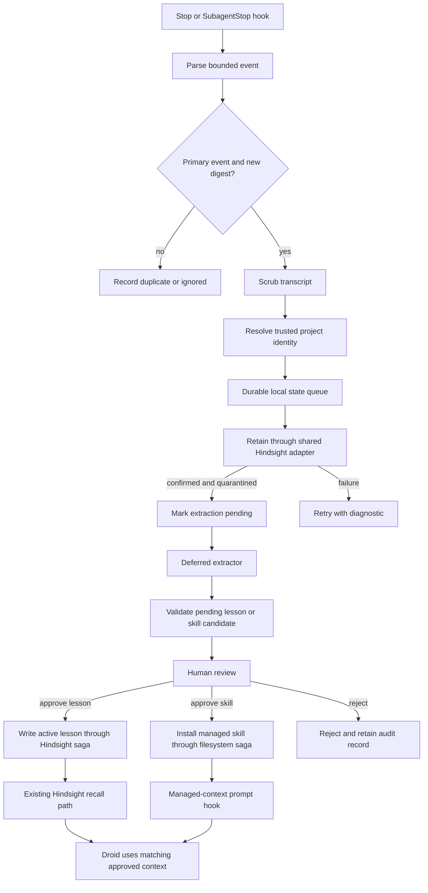
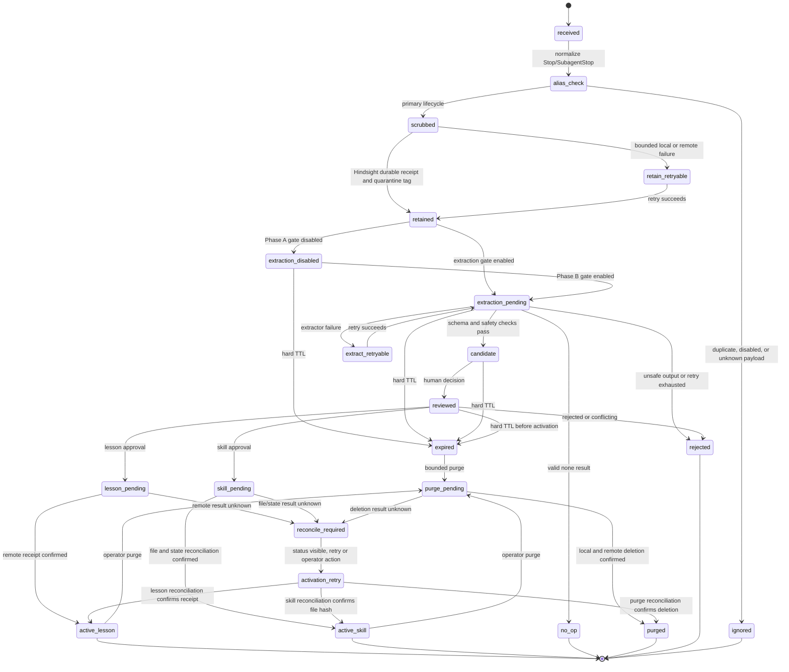

# Droid Memory Autolearn - Plan

## Goal Capsule

- **Objective:** Add a safe, worktree-stable automatic learning bridge for Droid using the shared OMP Hindsight bank.
- **Authority:** The Product Contract below defines behavior and scope. The Planning Contract defines implementation constraints. Current repository behavior and user instructions override stale memory.
- **Execution profile:** Cross-cutting user-level integration with a local queue, deferred model extraction, and explicit human review before generated skills become active.
- **Stop conditions:** Stop if the Hindsight write path cannot use authenticated HTTPS or a trusted local tunnel, if transcript scrubbing cannot prove that raw input was not retained, or if a generated skill would overwrite or shadow an authored skill.
- **Tail ownership:** The implementation must finish with focused tests, package checks, hook/config validation, and a safe local end-to-end smoke test. It must not commit or change remote state without separate user approval.

---

## Product Contract

### Summary

Droid currently has shared Hindsight recall, but it does not automatically retain scrubbed session knowledge, extract lessons later, or manage generated skills with an approval boundary. This feature adds those capabilities without placing raw transcripts, model-generated instructions, or unreviewed skills directly into durable context.

### Problem Frame

The same Git project can be opened through several linked worktrees, so cwd-only memory identity fragments project history. Stop-time hooks can observe a completed session, but synchronous model extraction would add latency, cost, and a new prompt-injection boundary to the user-facing stop path. Generated skills are higher-impact than ordinary memory because they change future agent behavior, so they require a separate pending state and explicit review.

### Requirements

#### Project identity and shared memory

- R1. Sessions from linked worktrees of the same Git project must resolve to one Hindsight project scope when a normalized `upstream`, `origin`, or other Git remote is available.
- R2. Git repositories without a usable remote must use a stable identity derived from the canonical Git common directory, not the current worktree path.
- R3. Non-Git directories must use a collision-resistant identity derived from the canonical directory path and must not use the basename alone.
- R4. Automatic retention must derive identity from trusted local workspace state; transcript content, model output, and hook payload text must never select an arbitrary Hindsight bank or project tag.
- R5. Explicit project-key overrides remain available only through trusted operator configuration and must be normalized and validated before use.

#### Automatic retention

- R6. A completed primary Droid session must enqueue a bounded, scrubbed transcript for retention without blocking the interactive stop path on model inference.
- R7. The retention path must share the existing OMP Hindsight bank and project-tag convention used by Codex and Grok.
- R8. Retention must be idempotent across repeated `Stop` and `SubagentStop` notifications, retries, and process restarts.
- R9. A retention failure must remain visible in local state and must never advance the lesson-extraction state.

#### Scrubbing and data minimization

- R10. The system must persist only a scrubbed transcript representation, never the raw hook payload or raw transcript as a fallback.
- R11. Scrubbing must remove common credentials, bearer tokens, private-key material, JWTs, secret-bearing environment assignments, memory-injection blocks, binary/base64 payloads, and unbounded tool output.
- R12. Scrubbing must cap per-message and per-session size, normalize workspace paths, preserve enough user and assistant text for lesson extraction, and fail closed when parsing or sanitization is ambiguous.
- R13. Local scrubbed artifacts must use restrictive permissions, a bounded retention period, and an explicit purge operation.
- R14. Transcript paths must be confined to an approved session root and opened as regular, non-symlink files with race-resistant checks.

#### Deferred lesson extraction

- R15. Lesson extraction must run only after confirmed Hindsight retention and outside the stop-time request path.
- R16. Extraction must treat the retained transcript as untrusted data, return a schema-validated result, and produce no shell commands, executable files, secrets, or private customer data.
- R17. Extraction must be bounded by idle-age, concurrency, token, byte, retry, and per-session cooldown limits.
- R18. A failed, malformed, or suspicious extraction result must create no active memory or skill and must remain retryable or rejected with a diagnostic reason.

#### Reviewable generated skills

- R19. Generated skills must first be written as pending candidates outside the active skill discovery directory.
- R20. Activation must require a separate interactive operator approval tied to the candidate content hash; non-interactive hooks and model-driven subprocesses must be refused.
- R21. Active generated skills must live in a separate managed directory loaded by an explicit Droid prompt hook and shared by all registered worktrees resolving to the same project identity.
- R22. Authored project, user, and plugin skills always take precedence; candidate creation or approval must refuse name collisions rather than overwrite or shadow authored skills.
- R23. Managed skill writes must reject traversal, symlinks, hard links, non-regular files, oversized content, unsafe names, and malformed frontmatter.
- R24. The agent must not be able to approve or activate a generated skill through model output alone.

#### Operations and compatibility

- R25. Installation must preserve existing Droid hooks and be idempotent across repeated runs.
- R26. The bridge must reuse the existing shared Hindsight adapter surface rather than creating a new per-agent bank or private namespace.
- R27. The feature must be disabled by default until the operator enables automatic retention and the secure Hindsight write prerequisite is satisfied.
- R28. The system must expose status, pending candidates, retention failures, and purge controls without printing secrets or raw transcripts.
- R29. Project filesystem segments must include a digest of the full canonical identity, and stored records must retain that full identity for collision checks.
- R30. Managed-skill prompt context must be bounded, project-strict, escaped, and distinguishable from ordinary recalled memory.
- R31. Unreviewed automatic-retention documents must use a quarantine tag, must not carry the normal project tag, and must remain excluded from ordinary project recall; only approved lessons use the normal project tag.
- R32. Approval of a lesson must write one bounded project-tagged active memory with the candidate ID and content hash, and repeated approvals must converge to one memory.
- R33. Remote identity is a namespace, not authorization; automatic retention and managed-context injection require explicit operator enablement bound to the canonical Git common directory or registered linked-worktree roots.

### Actors

- A1. **Droid hook runtime**, which supplies a session event and transcript location.
- A2. **Local memory bridge**, which resolves identity, scrubs input, tracks state, and calls the shared Hindsight adapter.
- A3. **Deferred extractor**, which reads only scrubbed retained artifacts and returns structured lesson candidates.
- A4. **Human reviewer**, who inspects, approves, rejects, or purges candidates.
- A5. **Droid runtime**, which recalls shared memory and discovers only approved managed skills.

### Key Flows

- F1. **Stop-time retention:** A primary session stop event is deduplicated, its transcript is scrubbed and bounded, identity is resolved from the workspace, and a background retainer confirms the scrubbed document in Hindsight. Extraction is scheduled only after that confirmation.
- F2. **Deferred extraction:** A worker claims retained sessions that are old enough and not already processed, asks a bounded Droid execution to return structured lessons, validates the result, and stores pending candidates.
- F3. **Human review:** The reviewer lists a pending candidate, reads its scrubbed evidence and proposed diff, then approves or rejects the exact canonical candidate-envelope hash from a separate operator process. Approval starts an idempotent saga that either writes the active lesson to Hindsight or installs the managed skill, then reconciles local state across crashes without activating anything from model output alone.
- F4. **Cross-worktree use:** A later prompt resolves the same remote identity from an enrolled linked worktree, recalls the shared Hindsight tag, and exposes only matching approved managed skills through the project-strict managed-context hook.

### Acceptance Examples

- AE1. **Given** two linked worktrees with the same normalized remote, **when** each retains a session, **then** both documents use the same Hindsight project tag and neither creates a cwd-specific project.
- AE2. **Given** a Stop event containing a transcript with a bearer token, memory tags, a large tool result, and a private key block, **when** the hook processes it, **then** the retained content contains none of those values and remains below configured limits.
- AE3. **Given** the same Stop event is delivered twice and a retain request times out after the server may have accepted it, **when** the bridge retries, **then** the final state contains one logical document and one extraction job.
- AE4. **Given** a scrubbed transcript has been confirmed retained successfully, **when** the extractor runs, **then** it can create a pending lesson or skill candidate but cannot create active memory or an active skill.
- AE5. **Given** a candidate name matches an authored skill, **when** a reviewer approves it, **then** activation is refused and the authored skill remains unchanged.
- AE6. **Given** an enrolled project and a reviewer approves a valid candidate with a matching canonical candidate-envelope hash from a separate operator process, **when** activation completes, **then** the managed skill is available through the managed-context hook from another registered worktree of the same project, without modifying authored skills.
- AE7. **Given** the Hindsight endpoint is remote HTTP without authentication or a trusted tunnel, **when** automatic retention is enabled, **then** the bridge refuses writes and reports the prerequisite instead of sending transcript data.
- AE8. **Given** an unreviewed scrubbed transcript is retained, **when** ordinary project recall runs, **then** the transcript is excluded by its quarantine tag; after lesson approval, the bounded lesson is recallable under the normal project tag with provenance.
- AE9. **Given** an unrelated clone sets its remote URL to the same project, **when** it has not been enrolled, **then** automatic retention and managed-skill context are refused.

### Scope Boundaries

#### In scope

- Shared remote-based identity with safe Git and non-Git fallbacks.
- Stop-time transcript intake, scrubbing, bounded local storage, idempotent Hindsight retention, and retry state.
- Deferred extraction into pending lessons and pending managed-skill candidates.
- Explicit review, approval, rejection, purge, and safe managed-skill activation.
- User-level Droid hook and managed-skill installation that preserves existing configuration.
- Focused unit, integration, CLI, and local end-to-end verification.

#### Deferred to Follow-Up Work

- Hindsight-side mental-model refresh policy beyond the existing shared bank.
- Automatic cross-session consolidation beyond the bounded lesson extraction result.
- A web UI for candidate review.
- Cross-machine synchronization of pending candidates or approval records.
- Replacing the existing Codex/Grok adapter implementation with a new shared package.

#### Outside this product's identity

- Storing secrets, raw private customer data, credentials, or complete unredacted transcripts.
- Automatically executing generated skill scripts, shell commands, or model-produced code.
- Letting generated skills override authored skills.
- Creating agent-private Hindsight banks such as `codex::*`, `grok::*`, or `droid::*`.

### Success Criteria

- Linked worktrees share one remote-derived Hindsight scope, while unrelated directories remain isolated.
- Duplicate or retried stop events do not create duplicate logical retention jobs.
- A scrubber test corpus proves secret, prompt-injection, path, size, and binary defenses.
- Extraction never runs before retention succeeds and never activates a skill without review.
- Approved skills are available from another enrolled worktree of the same project without modifying authored skills.
- The installed hook path remains bounded, fail-closed, and compatible with the existing Hindsight recall hook.

---

## Planning Contract

### Key Technical Decisions

- **KTD1. Use the shared OMP Hindsight bank with staged tags.** Automatic intake uses the existing adapter's shared bank and a quarantine tag that ordinary project recall excludes at both recall and consolidation layers. Approved lessons use the normal project tag with provenance metadata. Identity is derived locally from the workspace. This preserves recall parity across Droid, Codex, and Grok without exposing unreviewed transcripts as trusted memory. Automatic retention remains disabled unless the deployed adapter proves these capabilities. (session-settled: user-directed — chosen over per-agent banks: all agents must share OMP memory)
- **KTD2. Normalize Git remote identity before local fallbacks.** Prefer `upstream`, then `origin`, then the first usable remote. For remote-less Git, hash the canonical Git common directory. For non-Git directories, hash the canonical directory path. This preserves worktree sharing while preventing basename collisions. (session-settled: user-directed — chosen over cwd-only identity: worktrees of one Git project must share memory)
- **KTD3. Retain first, extract later.** The Stop hook performs only bounded scrubbing, state transition, and Hindsight retention. Model extraction runs after a successful retain through a deferred worker. This keeps the interactive path fast and prevents an extraction failure from losing the source record. (session-settled: user-directed — chosen over synchronous extraction: automatic retention must be implemented before lesson extraction)
- **KTD4. Use an explicit local state machine with durable idempotency keys.** Key each lifecycle by project identity, primary session identifier, and transcript-root identity. Treat `Stop` and `SubagentStop` as aliases, and store transcript digests as revisions on one stable session document. Store `received → scrubbed → retained → extraction_disabled|extraction_pending → candidate → reviewed` transitions with phase-specific retry states, no-op terminal state, purge state, activation reconciliation state, leases, fencing tokens, and retry metadata. This handles duplicate hooks, timeouts, restarts, and concurrent workers without relying on best-effort marker files.
- **KTD5. Fail closed at the transport boundary.** Automatic Hindsight writes require an operator-provisioned adapter or proxy with authenticated HTTPS or authenticated loopback transport, redirect and downgrade rejection, server-side quarantine exclusion, durable retain receipts, and idempotent deletion or an equivalent enforced TTL. The bridge verifies a versioned capability contract without mutating the existing user adapter. The adapter must expose token authentication without returning transcript payloads in results or errors. A remote plaintext endpoint or incomplete capability set is recall-only until secured. The bridge must never log authorization headers, transcript content, or full endpoint configuration.
- **KTD6. Treat transcript and extractor output as hostile data.** Scrub before persistence, wrap transcript content as data in the extraction prompt, validate all model output against a strict schema, and reject content containing secrets, executable artifacts, unsafe paths, or instruction-boundary markers.
- **KTD7. Make managed skills review-gated and physically isolated.** Pending candidates live under the bridge's private pending store, outside the active skill discovery root. Approval checks the canonical candidate envelope hash and authoritative authored-skill resolver, then uses a filesystem-atomic step inside an idempotent activation saga to write markdown-only `SKILL.md` files below `~/.factory/managed-skills/<project-segment>/`. The managed root is global for the user but partitioned by a digest-bearing project segment so linked worktrees share candidates and approved skills. The best available operator boundary is a foreground process started outside Droid, with a displayed one-time nonce and explicit candidate confirmation. Hooks and workers are refused. The plan does not claim to defend against a fully compromised same-user account.
- **KTD8. Use an explicit prompt hook for project matching.** Do not depend on undocumented recursive native skill discovery. The installer adds a managed-context prompt hook that reads only approved markdown from `~/.factory/managed-skills/<project-segment>/`, escapes and bounds it, and injects it under a dedicated managed-skills context marker. Authored skills remain on the native skill surface and keep precedence.
- **KTD9. Keep generated skills non-executable.** Candidate and active formats contain frontmatter plus markdown only. Scripts, templates, attachments, embedded code intended for execution, and arbitrary file writes are outside the activation contract.
- **KTD10. Separate automatic intake from recallable memory.** Retained transcripts use only a quarantine tag, not the normal project tag, and remain excluded from ordinary project recall until review. Approved lessons are written under a stable candidate-derived document ID with the normal project tag, candidate hash, source session, and source revision metadata.
- **KTD11. Treat external contracts as hard prerequisites.** Factory hook payloads, hook-output composition, Droid extraction isolation, authored-skill resolution, and the secure Hindsight adapter are versioned capability seams. The feature refuses the affected phase when a capability probe or runtime smoke cannot prove the contract; it does not guess or silently degrade.
- **KTD12. Use idempotent sagas across storage boundaries.** Hindsight, SQLite, and the managed-skill filesystem cannot share one transaction. Approval and purge therefore use durable `pending`, `confirmed`, `reconcile_required`, and terminal states with stable content/document IDs, fencing tokens, and restart reconciliation rather than claiming cross-store atomicity.

### High-Level Technical Design

The following diagrams describe the authoritative lifecycle and component boundaries.





### Assumptions

- The shared OMP Hindsight bank remains the memory boundary, but automatic writes require a deployed versioned adapter contract that adds authenticated transport, staged-tag enforcement, durable receipts, and deletion or enforced TTL. The bridge does not mutate the existing user-level adapter; deployment of the compatible adapter or proxy is an operator prerequisite.
- Droid hook payloads provide a versioned session capability, primary-session identity, parent/child role, transcript-root provenance, trusted workspace root, and hook origin. If required fields are absent or cannot be verified, the event is recorded as ignored rather than retained without an idempotency key.
- The prompt hook can return bounded additional context for the active prompt. Native recursive discovery is not required for generated skills.
- Factory output composition for multiple prompt-context hooks is verified before enabling U8. The bridge either composes with the existing Hindsight block under a global bound or refuses managed-context activation.
- Automatic retention is opt-in and does not change the existing manual recall/retain behavior.

### Implementation Constraints

- Use structured subprocess argument arrays or direct APIs. Never interpolate transcript text, model output, project identity, or paths into a shell command.
- Keep all local state and candidate files user-private and bounded. Never print raw transcript content in status output.
- Create user-private directories as `0700` and files as `0600` independent of process umask, protect SQLite WAL/SHM/journal sidecars, use descriptor-relative no-follow writes, and fsync files plus parent directories before reporting durable activation or purge.
- Preserve existing hook entries, Orca bridge behavior, Hindsight recall injection, and unrelated user configuration.
- Keep source code in the repository-owned tool directory and make user-level installation reproducible and idempotent.
- Use the repository's existing Bun and TypeScript validation conventions for touched OMP code. Use the Python standard library for the small user-level bridge unless an existing dependency is already guaranteed.

### Sequencing

1. Establish identity, secure transport, and adapter compatibility before accepting any transcript.
2. Add the scrubber and hook intake with no extraction or skill activation.
3. Add durable retention state and prove idempotent Hindsight writes.
4. Add deferred extraction and candidate validation behind a separate opt-in control.
5. Add review commands, active lesson writes, and managed-skill activation.
6. Install the prompt-context bridge and a bounded background worker, run the end-to-end smoke test, and enable only after secure transport validation.

### Dependencies and Prerequisites

- A user-provisioned Hindsight adapter or local proxy that provides authenticated transport, rejects redirects and downgrades, accepts the shared `omp` bank and staged tags, excludes quarantine documents from recall and consolidation by default, exposes an unambiguous durable-retention receipt, and supports authenticated idempotent deletion or an enforced retention TTL. The bridge must verify a versioned capability response that is bound to the configured bank, tags, document ID, and request digest. The bridge does not silently upgrade or replace the existing Codex adapter.
- A versioned Droid hook payload contract for event version, primary-session identity, parent/child role, transcript-root provenance, trusted workspace root, hook origin, and terminal lifecycle events. The installer must verify actual output-composition semantics for existing `UserPromptSubmit` producers before enabling managed context.
- A separate operator TTY for review and approval. Non-interactive approval must remain unavailable to Droid hooks and extraction workers.
- The installed Droid runtime must support the bounded no-tools extraction contract and prompt additional-context hook used by U4 and U8. Extraction is disabled unless an actual capability probe proves filesystem, network, credential, process, tool, hook, MCP, and extension isolation.
- An operator enrollment record for each enabled project, bound to the canonical Git common directory or registered linked-worktree roots. A normalized remote alone is never treated as authorization.

---

## Output Structure

```text
tools/droid-memory/
├── droid-memory
├── cli.py
├── approval.py
├── config.py
├── identity.py
├── adapter_contract.py
├── hindsight_bridge.py
├── transcript_reader.py
├── scrubber.py
├── hook.py
├── state.py
├── retainer.py
├── extractor.py
├── executor_contract.py
├── worker.py
├── candidates.py
├── review.py
├── approval.py
├── active_lessons.py
├── managed_skills.py
├── installer.py
├── managed_context.py
├── worker_trigger.py
├── managed-skill-loader.md
├── prompts/
│   └── lesson-extraction.md
└── tests/
    ├── fixtures/
    └── test_*.py
```

---

## Implementation Units

### U1. Trusted project identity and Hindsight bridge

**Goal:** Provide one deterministic identity and one shared-bank transport boundary for all automatic memory operations.

**Requirements:** R1, R2, R3, R4, R5, R7, R25, R26, R29, R33.

**Dependencies:** None.

**Files:**

- `tools/droid-memory/identity.py`
- `tools/droid-memory/adapter_contract.py`
- `tools/droid-memory/hindsight_bridge.py`
- `tools/droid-memory/config.py`
- `tools/droid-memory/tests/test_identity.py`
- `tools/droid-memory/tests/test_hindsight_bridge.py`
- `tools/droid-memory/tests/test_adapter_contract.py`

**Approach:** Define a versioned identity algorithm with golden vectors. Normalize remote-backed identities, hash the canonical Git common directory for remote-less Git, and hash the canonical non-Git path for local isolation. Add the full normalized identity to every local record and use a digest-bearing filesystem segment. Bind automatic writes and managed context to an operator enrollment for the canonical Git common directory or registered linked-worktree roots; enrollment stores owner/mode, device/inode, canonical common-directory metadata digest, and an operator approval timestamp, then revalidates those values on every use. A replacement root or changed Git common metadata requires revoke and re-enrollment. A matching remote alone does not authorize access. The bridge calls a versioned adapter contract through structured JSON-RPC. The contract must report authenticated HTTPS or authenticated loopback transport, exact bank/tag enforcement, quarantine exclusion at recall and consolidation, opaque receipts, durable receipt polling, and authenticated idempotent deletion or an enforced retention TTL. It must reject redirects and downgrades and never return request payloads. If the deployed adapter does not satisfy the contract, automatic writes remain disabled. Explicit project keys are accepted only from validated operator configuration, never from transcript-derived fields.

**Technical design:** The adapter contract exposes `capabilities`, `retain`, `operation_status`, `recall_policy`, and `delete` methods. A retain request includes the shared bank, one quarantine tag, stable document ID, monotonic revision, canonical content digest, and scrubbed content. The canonical request envelope uses sorted UTF-8 JSON with normalized newlines and a versioned SHA-256 digest. A successful response contains only the operation ID, document ID, applied tag set, content digest, revision, and durable state. `operation_status` and `delete` return the same bound fields, never transcript payloads. The bridge refuses a response whose bank, tags, IDs, revision, digest, or capability version do not match the local request. A TTL-only adapter must report configured expiry and replica coverage before the bridge can mark purge complete. When the adapter is a local executable or proxy, the bridge validates an operator-owned path, restrictive mode, pinned version/digest, exact endpoint, certificate policy, and least-privilege credential source before enabling writes.

**Patterns to follow:** `packages/coding-agent/src/memory-project-identity.ts`, `packages/coding-agent/src/memory-project-identity.test.ts`, and the existing user-level Hindsight adapter's project-tag contract.

**Test scenarios:**

1. **Happy path:** Two linked worktrees with the same `upstream` remote resolve to the same normalized key, segment, and project tag.
2. **Happy path:** When `upstream` and `origin` both exist, `upstream` wins, and SSH and HTTPS forms normalize to the same key.
3. **Edge case:** A remote-less repository and its linked worktree resolve to the same common-directory-derived key.
4. **Edge case:** Two non-Git directories with the same basename resolve to different keys, while repeated resolution of one canonical path is stable.
5. **Error path:** An explicit override containing traversal, control characters, or an empty value is rejected before adapter invocation.
6. **Error path:** A remote HTTP write, redirect, missing token, or adapter contract mismatch is refused, while recall-only probing remains available.
7. **Integration:** A fake adapter receives only the shared bank, normalized project tag, digest, and stable session document identifier, and its capability response is rejected when it is not bound to the configured request digest.
8. **Integration:** Golden vectors prove the identity schema across bridge and adapter fixtures, while fallback segments remain collision-resistant and an unregistered common directory cannot use a registered remote scope.
9. **Integration:** The fake adapter exposes durable retain, polling, staged-tag, and deletion capabilities; mismatched or payload-bearing responses fail closed without exposing transcript content.
10. **Integration:** Replacing an enrolled root, changing its ownership/mode, or changing its Git common-directory metadata revokes eligibility until an operator re-enrolls it.

**Verification:** Identity outputs are stable across worktrees and isolated across unrelated directories. The bridge never sends a write request through an insecure transport and never exposes credentials, request bodies, or server response bodies in errors or logs.

### U2. Hook intake and transcript scrubber

**Goal:** Convert a Droid stop event into a bounded scrubbed record without persisting or forwarding raw transcript data.

**Requirements:** R6, R8, R10, R11, R12, R13, R14, R25, R28.

**Dependencies:** U1.

**Files:**

- `tools/droid-memory/hook.py`
- `tools/droid-memory/scrubber.py`
- `tools/droid-memory/transcript_reader.py`
- `tools/droid-memory/tests/test_scrubber.py`
- `tools/droid-memory/tests/test_hook.py`
- `tools/droid-memory/tests/fixtures/transcripts/secret-heavy.jsonl`
- `tools/droid-memory/tests/fixtures/transcripts/prompt-injection.jsonl`

**Approach:** Validate a versioned event schema containing a runtime-issued session capability, primary-session ID, parent/child role, event type, trusted workspace root, transcript root, and hook origin before reading any transcript. Require transcript paths below the capability-bound session root, canonicalize and verify ownership, reject symlinks/devices/hard links, and use descriptor-relative no-follow reads with byte and line limits. Convert input to a default-deny typed scrubbed record containing only bounded user request, decision, outcome, validation, and compact assistant/tool-summary fields. Normalize Unicode, strip memory tags and protocol markers, redact credential patterns and sensitive assignments, detect high-entropy and encoded material, normalize workspace paths, discard binary-like payloads, and cap every output. Run the same DLP/scrubber invariant before local persistence, adapter forwarding, candidate creation, and active writes. On malformed input, unverifiable provenance, or uncertain sanitization, write only a non-sensitive failure record and do not forward content. Treat `SubagentStop` as an alias candidate for the primary lifecycle, not as a second event class.

**Technical design:** Hook JSON from stdin is untrusted. The runtime must provide an inherited capability FD or equivalent non-stdin authenticated channel containing a versioned, expiry-bound capability bound to event type, primary session, parent/child role, trusted workspace root, transcript-root device/inode, and audience. The hook verifies the capability before reading the payload and rejects missing, replayed, expired, or mismatched capabilities. If the installed Factory runtime cannot provide this channel, automatic retention remains disabled rather than treating a caller-controlled `hook origin` field as proof.

**Execution note:** Start with failing scrubber tests for secret and injection fixtures before wiring the hook command.

**Patterns to follow:** `packages/coding-agent/src/hindsight/content.ts` for memory-tag stripping and substantive-content checks, plus the repository logging and path-sanitization rules in `AGENTS.md`.

**Test scenarios:**

1. **Happy path:** A valid primary transcript yields a scrubbed record containing the user request and bounded assistant outcome while omitting raw tool payloads.
2. **Edge case:** Memory, mental-model, and legacy memory XML blocks are removed without deleting adjacent substantive text.
3. **Edge case:** Absolute workspace paths normalize to a stable placeholder, and transcript paths outside the allowlisted session root, symlinks, hard links, devices, and traversal attempts are refused.
4. **Error path:** Bearer tokens, common API-key formats, JWTs, private-key blocks, secret assignments, and base64-like blobs are redacted or cause the containing field to be dropped.
5. **Error path:** Oversized, malformed, binary-like, or ambiguous transcript input produces no raw fallback and returns a non-sensitive diagnostic.
6. **Integration:** Duplicate `Stop` and `SubagentStop` payloads resolve to one primary lifecycle key and do not create two retained records.
7. **Integration:** The hook exits within its configured intake budget even when the transcript path is missing, unreadable, or very large.
8. **Integration:** A child-only, out-of-order, missing-capability, wrong-root, or caller-forged event is ignored and cannot retain another session's transcript.
9. **Integration:** The scrubbed-record schema and independent DLP check reject uncertain fields and prove no raw input, high-entropy secret-like value, or encoded payload reaches local persistence, adapter forwarding, or candidate fixtures.

**Verification:** Fixture inspection proves that secret literals and injected instructions do not survive scrubbing. A temporary HOME test proves permissions and cleanup behavior without touching the real user memory directory.

### U3. Durable retention queue and idempotent Hindsight writes

**Goal:** Persist scrubbed records, execute bounded Hindsight retention, and advance extraction only after confirmed success.

**Requirements:** R6, R7, R8, R9, R13, R15, R17, R26, R27, R28, R31.

**Dependencies:** U1, U2.

**Files:**

- `tools/droid-memory/state.py`
- `tools/droid-memory/retainer.py`
- `tools/droid-memory/tests/test_state.py`
- `tools/droid-memory/tests/test_retainer.py`
- `tools/droid-memory/tests/test_retention_integration.py`

**Approach:** Use a user-private SQLite database with a durable lifecycle key, primary session ID, transcript revision digest, full project identity, lease, fencing token, retry phase/time, scrubbed artifact path, remote receipt, local/remote purge state, and bounded diagnostic fields. Retain automatic transcripts with only a quarantine tag, never the normal project tag, and require the adapter receipt to prove the bank, tag, document ID, and content digest. Use one stable Hindsight document ID per project and primary session, `replace` semantics with monotonic revision fencing, and synchronous confirmation or operation polling before advancing to `extraction_pending`. Keep scrubbed artifacts until extraction and review reach a terminal state or the hard TTL expires. The hard TTL takes precedence over pending review or disabled extraction, moves the row to `expired`, and purges local evidence while preserving only non-sensitive audit state. Bound retention and extraction retries separately. A SessionStart worker is only an eventual bounded drain trigger; manual drain remains available and a singleton lock prevents process fan-out. Purge requests authenticated remote deletion for all retained revisions and derived representations, or records failed/pending state when the configured enforced TTL is the only supported deletion guarantee. A TTL-only adapter cannot report `purged` until expiry is confirmed for all configured replicas and derived representations.

**Concurrency contract:** Each claimed row carries a random fencing token and owner epoch. Every post-I/O state update uses a compare-and-set predicate over row ID, expected state, owner epoch, and fencing token. Lease renewal is conditional on the same token. Transcript revisions use a local monotonic sequence and remote compare-and-set when supported; a stale adapter response is recorded but cannot replace a newer revision or enqueue extraction.

**Patterns to follow:** `packages/coding-agent/src/memories/storage.ts` for leases, watermarks, retry state, and project-scoped global jobs; `packages/coding-agent/src/hindsight/state.ts` for retain lifecycle and failure logging.

**Test scenarios:**

1. **Happy path:** A scrubbed event is retained once and transitions to `extraction_pending` only after the fake adapter confirms durable persistence or a successful operation poll.
2. **Edge case:** Replaying the same lifecycle after a timeout or process restart reuses the same document ID, records a new revision, and does not create a second logical job.
3. **Edge case:** Two workers attempting the same pending row result in one lease holder and one deferred claimant.
4. **Error path:** Adapter failure leaves the event retryable with a bounded backoff and never creates an extraction candidate.
5. **Error path:** A malformed adapter response or insecure transport leaves the event failed without logging content or authorization data.
6. **Integration:** A successful retain followed by worker restart preserves the `extraction_pending` transition and the scrubbed artifact path.
7. **Integration:** A lease-expiry race cannot let an old worker commit after a new fencing token is issued.
8. **Integration:** Out-of-order transcript revisions cannot replace a newer remote revision or create an extraction job for stale content.
9. **Integration:** Fake recall and consolidation paths exclude quarantine-only documents, while an approved lesson with the normal project tag is returned with provenance.
10. **Integration:** Purge removes only terminal or explicitly operator-authorized scrubbed artifacts and candidate evidence, checkpoints protected SQLite sidecars, requests remote deletion for every retained revision, and preserves only non-sensitive status metadata when deletion completes.
11. **Integration:** Phase A retains a row as `extraction_disabled` without starting the extractor, and Phase B promotes only confirmed retained rows to `extraction_pending`.
12. **Integration:** The hard TTL expires a pending review or disabled row, purges local evidence, and leaves a visible non-sensitive `expired` or `purge_pending` state when remote deletion is not yet confirmed.

**Verification:** State transitions are atomic and restart-safe. Repeated stop events and retryable network failures converge to one retained document and one extraction job. Parent directories are user-owned `0700`, files and SQLite sidecars are `0600`, writes are no-follow and descriptor-relative, and remote deletion is reported as complete, pending, or failed.

### U4. Deferred lesson extraction and candidate validation

**Goal:** Extract durable lessons and skill candidates after retention through a bounded, isolated Droid execution.

**Requirements:** R15, R16, R17, R18, R19, R28.

**Dependencies:** U3.

**Files:**

- `tools/droid-memory/extractor.py`
- `tools/droid-memory/worker.py`
- `tools/droid-memory/prompts/lesson-extraction.md`
- `tools/droid-memory/candidates.py`
- `tools/droid-memory/executor_contract.py`
- `tools/droid-memory/tests/test_extractor.py`
- `tools/droid-memory/tests/test_candidates.py`
- `tools/droid-memory/tests/test_worker.py`

**Approach:** Claim only idle `extraction_pending` rows with a fencing token. Invoke the installed Droid with a versioned no-tools/no-hooks/no-extensions extraction contract in an OS-enforced sandbox with a temporary HOME and read-only working directory containing only the scrubbed artifact. The capability probe must prove blocked access to the real HOME, credentials, Hindsight/Factory sockets, child-process tools, and unapproved network destinations. If model inference requires network access, only an explicitly configured provider endpoint and dedicated credential channel may be available; general environment credentials and Hindsight credentials remain unavailable. Pass structured arguments rather than a shell command and cap stdout, stderr, CPU time, wall time, and process-group lifetime. The prompt must state that the transcript is untrusted data and that only a strict JSON result is acceptable. Validate lesson length, candidate name, description, markdown body, evidence references as opaque record IDs, secret patterns, frontmatter, path boundaries, and size before writing any pending candidate. Empty output is a successful no-op. A `skill` result is rejected as a disabled feature until Phase C explicitly enables the skill-candidate gate.

**Technical design:** The executor contract records the installed Droid version, exact documented invocation flags, sandbox policy, provider endpoint allowlist, and dedicated credential channel. On macOS, the supported adapter launches an operator-configured absolute Droid executable through an OS sandbox profile with deny-default filesystem and network rules, a temporary HOME, a read-only artifact mount, a dedicated provider-only egress rule when needed, no Hindsight or Factory sockets, and a process-group kill boundary. It verifies executable ownership/mode and a configured digest at launch. There is no unsandboxed fallback. The capability probe performs real denied-read, denied-write, denied-socket, denied-child-process, denied-credential, and unapproved-network attempts before any transcript is passed. The probe and launch policy must use the same verified executable and profile. The result schema is versioned and discriminated: `none` has no candidate; `lesson` requires a bounded title, lesson body, source session/revision, and extractor-selected evidence IDs; `skill` requires the same provenance plus a safe name, description, frontmatter, and markdown body. Evidence IDs are created outside the model and bind to an immutable scrubbed revision, bounded record range, and quote digest. The model may select existing IDs but cannot invent them. Unknown fields, missing required fields, invalid nullability, duplicate evidence IDs, executable content, or over-limit values are rejected. The extractor process may read the scrubbed artifact and emit JSON, but it cannot approve candidates, write active skill files, access general credentials, use hooks/MCP/extensions, or use transcript text as instructions. The worker enforces a timeout, output-size cap, concurrency limit, retry budget, per-session cooldown, and a shutdown-safe fencing lease outside the model process. Lesson candidates remain pending until review before any active Hindsight write.

**Sandbox prerequisite:** On the supported macOS runtime, the executor must use the verified `/usr/bin/sandbox-exec` profile interface or a stricter operator-provisioned sandbox with equivalent process, filesystem, network, credential, and IPC controls. If that interface or an equivalent control is unavailable, U4 remains disabled. The probe and the real launch must use the same verified absolute executable, profile, and process-group policy.

**Candidate integrity:** Canonicalize JSON with sorted keys, UTF-8, normalized newlines, and explicit schema-version fields before hashing. Recompute the candidate hash at review and activation. The candidate's source session, source revision, project identity, candidate kind, and evidence IDs must equal the worker-owned expected values, and every evidence quote digest must be recomputed from the immutable scrubbed revision.

**Patterns to follow:** `packages/coding-agent/src/memories/index.ts` for staged extraction and consolidation, `packages/coding-agent/src/prompts/memories/` for static prompt assets, and `packages/coding-agent/src/autolearn/controller.ts` for non-overlapping background capture.

**Test scenarios:**

1. **Happy path:** A confirmed-retained scrubbed transcript produces a schema-valid lesson or skill candidate with opaque evidence references and no active writes.
2. **Happy path:** A transcript with no durable lesson produces an empty candidate result and closes the extraction job without creating a skill.
3. **Edge case:** Repeated worker runs skip rows already claimed or completed and do not spend another extraction budget for the same digest.
4. **Error path:** Model output containing tool commands, prompt-boundary tags, secrets, invalid JSON, oversized content, filesystem paths, or executable artifacts is rejected.
5. **Error path:** Droid execution timeout, nonzero exit, or unavailable model records a retryable failure without exposing transcript content.
6. **Integration:** Confirmed Hindsight persistence is a prerequisite for extraction, and a failed or merely accepted retain leaves the worker with no claimable extraction row.
7. **Integration:** Candidate files survive a worker restart with status and content hash intact.
8. **Integration:** In Phase B, a valid `skill` result is recorded as a disabled no-op without a pending skill file; the same fixture creates a pending skill only after the Phase C gate is enabled.
9. **Integration:** Capability probes prove blocked real-HOME, credential, socket, process, and unapproved-network access, and extraction refuses to run when any probe fails.

**Verification:** A fake Droid executor proves the worker accepts only the declared JSON schema and cannot activate memory or a skill. A malicious fixture proves the executor cannot read outside its temporary HOME or invoke tools. No test uses source-grep assertions for behavior.

### U5. Human lesson review and active memory

**Goal:** Provide explicit lesson review and safe idempotent activation into shared Hindsight memory.

**Requirements:** R19, R20, R24, R28, R32.

**Dependencies:** U4 and the retention-only slice of U7.

**Files:**

- `tools/droid-memory/review.py`
- `tools/droid-memory/active_lessons.py`
- `tools/droid-memory/tests/test_lesson_review.py`

**Approach:** Store pending lesson candidates under a user-private pending root with candidate ID, project segment, full project identity, source session/revision, canonical candidate-envelope hash, opaque evidence record IDs, status, and review timestamps. The canonical envelope covers schema version, project identity, candidate kind, candidate ID, title/name, description, frontmatter, body, source session/revision, evidence IDs, and all activation-relevant metadata. The review command displays metadata and bounded evidence, requires a foreground process started outside Droid, a short-lived one-time nonce bound to candidate/project/hash/action, and explicit operator confirmation. It refuses non-interactive, hook-originated, worker-originated, and model-subprocess approval. Lesson approval writes a bounded active lesson to Hindsight with document ID `droid-lesson:<project-segment>:<candidate-id>`, the normal project tag, candidate hash, source session, and source revision metadata. SQLite state records `activation_pending`, `remote_write_unknown`, `active`, `reconcile_required`, and `purged` so a crash across local and remote stores is reconciled rather than treated as an atomic transaction. Repeated approval converges through the same document ID and receipt contract. Purge supports active lesson deletion by stable document ID and records pending/failed remote deletion without claiming success.

**Recovery contract:** For an unknown Hindsight result, query the operation or stable document ID and accept only an exact bank, tag, document ID, revision, and content-digest match. A missing result is retryable; a mismatched result is a non-sensitive conflict that cannot be overwritten. For local audit state, reconcile only the expected candidate hash and project segment. Never delete or replace an item whose current content, owner, inode, or path binding differs from the recorded activation envelope.

**Patterns to follow:** `packages/coding-agent/src/tools/learn.ts` for lesson persistence and partial-outcome reporting; `packages/coding-agent/src/hindsight/state.ts` for project-tagged retention and failure handling.

**Test scenarios:**

1. **Happy path:** An operator can list and inspect a pending lesson in a separate TTY, approve the unchanged content hash, and write one active project-tagged lesson.
2. **Happy path:** Rejection records the decision and leaves no active lesson.
3. **Edge case:** A candidate with a changed body, source revision, or hash after review is refused until re-reviewed.
4. **Error path:** A nonexistent, cross-project, stale, or model-invented evidence reference refuses approval without reading another candidate's evidence.
5. **Integration:** An approved lesson writes one project-tagged active memory with the stable candidate document ID and is idempotent across repeated approvals.
6. **Integration:** Model output, a non-interactive subprocess, or an untrusted candidate file cannot invoke the approval path without the operator TTY and hash check.
7. **Integration:** A crash before or after the Hindsight receipt leaves `reconcile_required` or `active` state and a retry converges to one document; it never appends a duplicate lesson.
8. **Integration:** Purging an approved lesson requests deletion by stable document ID and reports pending or failed remote deletion without removing the local audit record.

**Verification:** Approved lessons have the expected project tag, candidate ID, source provenance, and durable receipt. Rejected or tampered candidates cannot reach active Hindsight memory.

### U6. Reviewed managed-skill activation

**Goal:** Safely activate reviewed skill candidates in a separate managed directory without touching authored skills.

**Requirements:** R19, R20, R21, R22, R23, R24, R28, R29, R30.

**Dependencies:** U4, U5.

**Files:**

- `tools/droid-memory/managed_skills.py`
- `tools/droid-memory/tests/test_managed_skills.py`
- `tools/droid-memory/tests/fixtures/skills/authored/`

**Approach:** Store pending skill candidates with full project identity, source revision, canonical candidate-envelope hash, and opaque evidence IDs. Reuse U5's approval contract and verify the operator decision, candidate hash, source binding, authoritative effective authored-skill resolver, digest-bearing project segment, safe name, frontmatter, size, and file type before writing markdown-only `SKILL.md` below `~/.factory/managed-skills/<project-segment>/`. Serialize activation per project, perform directory-descriptor/no-follow checks, and recheck authored namespaces inside the activation saga. Record `file_pending`, `file_installed`, `reconcile_required`, `active`, and `purged` states. Reject traversal, symlinks, hard links, collisions, and executable attachments. Never delete or modify an authored file to resolve a conflict. Purge can disable and remove only an approved generated skill after the same operator authorization.

**Recovery contract:** A `file_installed` result is accepted only when the expected path, owner, mode, inode binding, and canonical content hash match the candidate envelope. If SQLite state is missing after a filesystem write, reconciliation adopts the file only when every binding matches; otherwise it marks a conflict and leaves the file untouched. Purge unlinks only the expected inode and hash, then fsyncs the parent directory. An unexpected replacement is never deleted by bridge recovery.

**Patterns to follow:** `packages/coding-agent/src/autolearn/managed-skills.ts` for name validation, description sanitization, size limits, symlink and hard-link protection, and serialized mutations; `packages/coding-agent/src/tools/learn.ts` for authored-skill precedence.

**Test scenarios:**

1. **Happy path:** A reviewed candidate with an unchanged content hash creates one valid markdown-only managed skill under the expected digest-bearing project segment.
2. **Happy path:** Rejection records the decision and leaves no active managed skill.
3. **Edge case:** A candidate with a changed body, source revision, or hash after review is refused until re-reviewed.
4. **Error path:** Traversal, symlink, hard-link, non-regular-file, unsafe-name, invalid-frontmatter, digest-collision, executable-attachment, or oversize conditions refuse activation without modifying authored files.
5. **Error path:** A candidate colliding with an authored project, user, or plugin skill is rejected with a clear non-sensitive reason.
6. **Integration:** An approved skill from one worktree is present under the same digest-bearing project segment when reviewed from another linked worktree.
7. **Integration:** A concurrent authored-skill creation or replacement cannot race a generated activation into a collision, and the loader refuses any collision discovered after activation.
8. **Integration:** Purging an approved generated skill removes only that managed file, preserves authored files, and records an auditable disabled state.

**Verification:** The managed root contains only approved, valid markdown skills. Authored skill fixtures remain byte-for-byte unchanged after conflict and attack tests.

### U7. Droid hook, CLI, and worker installation

**Goal:** Install the retention bridge into the user-level Droid configuration without replacing existing hooks and provide a stable operator CLI and worker trigger.

**Requirements:** R6, R25, R26, R27, R28.

**Dependencies:** U1, U2, U3 for the retention-only slice. U4 and U5 are required before extraction and lesson-review commands are enabled. U6 is required before skill-review commands are enabled. U8 is required before the managed-context installation flag is enabled.

**Files:**

- `tools/droid-memory/cli.py`
- `tools/droid-memory/approval.py`
- `tools/droid-memory/installer.py`
- `tools/droid-memory/worker_trigger.py`
- `tools/droid-memory/droid-memory`
- `tools/droid-memory/tests/test_cli.py`
- `tools/droid-memory/tests/test_installer.py`
- `tools/droid-memory/tests/test_worker_trigger.py`

**Approach:** Provide one operator CLI for install, uninstall, repair, status, identity, drain, extract, review, approve, reject, purge, and `mark-useful`, with a repository-owned launcher and a stable user-level installation path so the `droid-memory` command remains usable across worktrees and upgrades. Phase A exposes only retention, status, identity, drain, purge, and install controls; later commands fail closed until their unit and capability gate are enabled. The installer detects the effective Factory hook configuration, preserves a backup, merges Stop, SubagentStop, and SessionStart hooks by command identity, and preserves unrelated Orca and Hindsight entries. It creates the private pending root. A SessionStart-triggered detached worker drains one bounded batch with a per-user singleton lock and fencing-aware lease, and install/uninstall/repair owns that trigger. The installer adds the UserPromptSubmit managed-context hook only when the explicit Phase C enablement flag is used and U8's composition smoke passes. It never replaces the existing Hindsight prompt hook.

**Execution note:** Treat this as configuration and packaging work. Prefer `--help`, parser checks, and a local temp-HOME runtime smoke over broad unit-only proof.

**Phase-gate contract:** Persist `retention`, `extraction`, `skill_candidates`, and `managed_context` flags. The CLI includes `enable <phase>` and `disable <phase>`. `enable retention` requires adapter capability and enrollment checks. `enable extraction` promotes only confirmed, unexpired `extraction_disabled` rows after the executor capability probe. `enable skill_candidates` is allowed only after the Phase B promotion gate and affects new extractor results; existing disabled skill results remain no-op. `enable managed_context` requires the U8 composition smoke and installs one feature-gated prompt hook. Every enable/disable transition is operator-authenticated, durable, idempotent, and reversible without deleting artifacts. Destructive purge uses the same U5 approval helper, is dry-run by default, names an exact project/item scope, and refuses hook, worker, or model-originated calls.

**Patterns to follow:** Existing `hooks.json` merge behavior and Hindsight `UserPromptSubmit` additional-context output; current Droid skill format documented by the installed `skill-creation` skill.

**Test scenarios:**

1. **Happy path:** Installing twice produces one copy of each enabled bridge hook and preserves unrelated Orca and Hindsight hook entries.
2. **Happy path:** `identity`, `status`, `drain`, `review`, `purge --dry-run`, and `mark-useful` expose bounded non-sensitive output and valid exit codes when their phase gates are enabled.
3. **Edge case:** Missing optional hook fields, reordered JSON, and an existing command with equivalent behavior do not cause duplicate installation.
4. **Error path:** A malformed config, unexpected symlink, insecure adapter path, or unsupported Droid skill layout stops without overwriting the original configuration.
5. **Integration:** A temp HOME with a retention-only configuration installs without modifying unrelated hooks and preserves the backup.
6. **Integration:** The installed Stop hook accepts a versioned payload fixture, retains through a fake adapter, and returns without waiting for extraction.
7. **Integration:** Repeated SessionStart events start at most one worker, drain one bounded batch, reclaim stale leases through fencing, and shut down without leaving a live lease.
8. **Integration:** Enabling managed context adds exactly one prompt hook only after the U8 composition smoke passes; disabling or repairing removes only the bridge-owned entry.
9. **Integration:** Enabling extraction promotes only unexpired confirmed rows, enabling skill candidates does not activate skills or alter existing no-op results, and disabling a phase prevents new work while preserving status.

**Verification:** `--help` documents the CLI surface, invalid input exits nonzero, install is idempotent across both possible hook configuration locations, the secure-adapter capability probe and extraction-capability probe fail closed when prerequisites are absent, and the temp-HOME smoke proves the real retention hook/config/worker path without changing the live Factory configuration.

### U8. Managed-context activation

**Goal:** Make only reviewed, project-matching managed skills available in prompt context through an explicit, bounded hook.

**Requirements:** R21, R28, R29, R30.

**Dependencies:** U1, U6, U7.

**Files:**

- `tools/droid-memory/managed_context.py`
- `tools/droid-memory/managed-skill-loader.md`
- `tools/droid-memory/tests/test_managed_context.py`
- `tools/droid-memory/tests/test_discovery_smoke.py`

**Approach:** Accept a versioned JSON stdin payload from the installed `UserPromptSubmit` hook, derive the project identity locally rather than trusting the payload, require operator enrollment for the canonical Git common directory or registered linked-worktree root, and read only approved markdown below the current digest-bearing managed-skill segment. Use the installed runtime's authoritative effective skill resolver for collision and precedence checks where available; otherwise refuse activation for unsupported layouts. Escape content, enforce per-skill and aggregate bounds, and emit a dedicated untrusted managed-skills context block that composes deterministically with the existing Hindsight `<memories>` block under one global limit. The prompt contract places this content below system/developer instructions and grants it no authority to authorize tools, secrets, policy changes, or further context loading. Reject missing, malformed, cross-project, unregistered, symlinked, hard-linked, non-regular, or oversized files. Authored native skills remain outside this loader and keep their existing precedence. The hook must be unavailable to Stop, SubagentStop, SessionStart, and worker-originated invocations.

**Technical design:** The managed hook emits the Factory `hookSpecificOutput.additionalContext` envelope containing a bounded `<droid-managed-skills project-segment="..." trust="untrusted">` block. The existing Hindsight `<memories>` block remains first, managed context follows it, and the combined output is capped at the configured global byte budget after per-source caps. Truncation drops whole skills from the end and emits no partial markdown. The installer must prove this ordering and composition with the installed runtime; a last-wins or unbounded merge disables U8 rather than silently replacing Hindsight context.

**Test scenarios:**

1. **Happy path:** A prompt from a linked worktree receives the same approved managed-skill context as the source worktree.
2. **Edge case:** A prompt from another project receives no managed-skill content.
3. **Error path:** Malformed payloads, traversal, symlink, hard-link, non-regular, oversized, and invalid-markdown files produce bounded empty or error-safe output.
4. **Integration:** The loader cannot discover pending or authored skills and cannot activate a candidate without U6 approval.
5. **Integration:** Existing Hindsight context and managed-skill context compose without last-wins loss, exceed neither the per-source nor global bound, and preserve the existing Hindsight hook.
6. **Integration:** An unregistered clone with the same remote receives no managed context until an operator enrollment binds its canonical root.

**Verification:** The temp-HOME smoke proves project matching, bounded escaped output, no-follow reads, and no cross-project leakage. The effective Factory hook configuration shows the context hook only on the intended prompt event.

---

## Phased Delivery

- **Phase A, retention-only:** Ship U1-U3 plus the retention-only slice of U7 as an internal shadow release, including install, status, purge, secure transport validation, and the bounded SessionStart worker. Retained rows use an explicit `extraction_disabled` state and keep scrubbed artifacts within their bounded retention window. Status must say that no user-visible learning is active. No extraction, lesson approval, skill activation, or managed-context hook is enabled.
- **Phase B, deferred lessons:** Ship U4 and U5 behind an independent extraction flag. Measure candidate usefulness and reviewer effort before enabling skill candidates.
- **Phase C, reviewed skills:** After Phase B meets the measurable promotion gate below, enable U4's `skill_candidates` gate, then ship U6 and U8. U7's `enable skill_candidates` and `enable managed_context` commands remain the only activation path. U7 remains the installation and worker control plane across all phases.

## Success Metrics

- **Retention safety:** 100% of automatic writes use the canonical project identity and secure transport gate; zero raw transcript or credential literals appear in local artifacts or adapter diagnostics.
- **Lifecycle correctness:** Duplicate-event and retry tests converge to one primary session document and one extraction job.
- **Candidate usefulness:** Track candidate creation, approval, rejection, duplicate, disabled-skill, and no-op rates per project without retaining sensitive content. The default Phase B promotion gate requires at least 10 reviewed candidates, at least 3 approved lessons, an approval rate of at least 20%, and no unresolved privacy or transport failure.
- **Review cost:** Record review start/end timestamps and pending backlog counts in local non-content state. The default gate pauses activation when median review time exceeds 2 minutes or the backlog exceeds 50 candidates.
- **Recall value:** The operator can run `mark-useful <candidate-or-skill-id>` after a bounded recall or managed-context use. This stores only the project segment, stable item ID/hash, timestamp, and outcome. The default Phase C gate requires at least 5 useful acknowledgments over 14 days, or the operator must explicitly keep skills disabled.

---

## Verification Contract

| Area | Proof | Applies to |
| --- | --- | --- |
| Python bridge behavior | `python3 -m unittest discover -s tools/droid-memory/tests` | U1-U8 |
| OMP package integrity | `bun --cwd=packages/coding-agent run check` | Any touched OMP TypeScript or prompt integration |
| Targeted OMP regression coverage | Existing memory identity, Hindsight content, managed-skill, and autolearn tests plus new integration coverage | Any changed OMP memory surface |
| CLI contract | `droid-memory --help`, one valid identity/status invocation, and one invalid-input invocation | U7 |
| Hook/config shape | JSON parser validation and an idempotent temp-HOME install/readback | U2, U7, U8 |
| Hindsight boundary | Fake adapter integration plus a safe non-production health/retain smoke only after authenticated transport is confirmed | U1, U3, U5, U7 |
| End-to-end behavior | Temp HOME and temp Git repositories exercise Stop intake, scrub, retain, deferred candidate creation, review, approval, and cross-worktree discovery | U1-U8 |
| Security review | Inspect the final diff and fixtures for raw transcript persistence, secret literals, shell interpolation, path traversal, unsafe writes, and swallowed failures | U1-U8 |

The final verification must run the repository's applicable package checks after any OMP code change. It must not run a production Hindsight write or use the live user memory directory as a test fixture.

---

## System-Wide Impact

- **Shared memory:** Hindsight becomes a write destination for Droid-generated scrubbed records, so bank tags, document IDs, retention mode, and transport security affect Codex, Grok, and OMP recall.
- **Prompt context:** The prompt hook gains another additional-context producer. Its output must be bounded, clearly marked as untrusted background, and compatible with the existing `<memories>` block.
- **Filesystem:** The feature adds a user-private queue, pending candidate root, approval log, and managed skill root. None may overlap authored skill directories.
- **Lifecycle:** Stop, SubagentStop, prompt submission, worker restart, duplicate delivery, and process termination all cross the local state machine.
- **Cost and latency:** Retention is bounded and asynchronous where supported. Extraction is deferred, capped, and opt-in rather than competing with the interactive stop path.
- **Human boundary:** Approval is a local operator action, not a model action. Rejection and purge must be observable and reversible where possible.

---

## Risks and Dependencies

- **Plaintext remote Hindsight transport:** Sending transcripts over unauthenticated HTTP can expose durable project history. Mitigation: block automatic writes unless authenticated HTTPS or a trusted local tunnel is configured.
- **Adapter spoofing or contract drift:** A self-reported capability is not enough if the adapter executable, endpoint, or bank configuration is attacker-controlled. Mitigation: require an operator-provisioned adapter/proxy with user-owned executable and configuration, exact endpoint and certificate validation, least-privilege credential storage, request-digest-bound receipts, and a versioned capability smoke before enabling writes.
- **Prompt injection in transcripts:** User text, tool output, or prior model output can contain instructions aimed at the extractor or future Droid sessions. Mitigation: scrub, delimit as data, validate output, and inject only bounded untrusted context.
- **Secret retention:** Regexes are incomplete. Mitigation: use a conservative denylist, drop ambiguous fields, cap raw material, and fail closed rather than attempting a raw fallback.
- **Identity collision:** Basename fallbacks can merge unrelated projects. Mitigation: canonical path digests for non-Git directories and common-directory digests for remote-less Git.
- **Remote identity spoofing:** An unrelated clone can copy a victim remote URL. Mitigation: operator enrollment binds access to canonical common-directory or registered linked-worktree roots; remote equality is not authorization.
- **Quarantine bypass:** Client-side tag filtering may not protect shared-bank consolidation or broad recall. Mitigation: require adapter/Hindsight-side quarantine exclusion for recall and consolidation, or keep automatic retention disabled.
- **Duplicate hook delivery:** Stop and SubagentStop may describe one lifecycle more than once. Mitigation: durable event digests, primary-session filtering, leases, and stable Hindsight document IDs.
- **Authored-skill shadowing:** A generated skill can silently change behavior or be hidden behind an authored skill. Mitigation: scan all known authored namespaces and reject collisions.
- **Skill discovery drift:** Droid's personal skill discovery rules may change. Mitigation: installer smoke test against the installed CLI and keep active generated skills behind a project-matching discovery bridge.
- **Unbounded cost:** Extraction can run repeatedly after retries or many worktrees. Mitigation: idle-age threshold, concurrency cap, token/output cap, cooldown, retry budget, and status visibility.
- **Local process or file race:** Same-user processes can race leases, candidate validation, or generated-skill activation. Mitigation: fencing tokens, directory-descriptor/no-follow operations, explicit user-owned permissions, serialized activation, and reconcile-required states.
- **External adapter compatibility:** The current Hindsight adapter is user-level infrastructure. Mitigation: keep its JSON-RPC contract as the only integration seam, use a fake adapter in tests, and do not duplicate banks or silently substitute an endpoint.

---

## Operational Notes

- Enable automatic retention only after the Hindsight transport prerequisite is verified.
- Keep extraction disabled while validating scrubber fixtures and retention state transitions.
- Review pending candidates before enabling managed-skill discovery.
- Provide status output that reports counts and states, not transcript contents or credential-bearing errors.
- Purge expired scrubbed artifacts and rejected candidates on a bounded schedule.
- Preserve a reversible backup of the existing Droid hook configuration during installation.

---

## Sources and Research

- `packages/coding-agent/src/memory-project-identity.ts` and `packages/coding-agent/src/memory-project-identity.test.ts` establish remote, linked-worktree, and local fallback semantics.
- `packages/coding-agent/src/hindsight/content.ts` provides existing memory-tag stripping, substantive-content filtering, transcript framing, and recall-query bounds.
- `packages/coding-agent/src/hindsight/client.ts` and `packages/coding-agent/src/hindsight/state.ts` establish the shared Hindsight retain, recall, tag, async, and lifecycle patterns.
- `packages/coding-agent/src/memories/storage.ts` provides lease, watermark, retry, and project-scoped consolidation patterns.
- `packages/coding-agent/src/memories/index.ts` and `docs/memory.md` establish deferred stage-one extraction and stage-two consolidation behavior.
- `packages/coding-agent/src/autolearn/controller.ts`, `packages/coding-agent/src/sdk.ts`, and `packages/coding-agent/src/tools/learn.ts` establish stop gating, detached capture, authored-skill precedence, and managed-skill creation behavior.
- `packages/coding-agent/src/autolearn/managed-skills.ts` establishes the required filesystem safety controls for generated skills.
- `AGENTS.md` establishes Bun-first implementation, centralized logging, no shell interpolation, and focused contract testing.
- Current Factory documentation was consulted for Droid hooks, `droid exec`, custom Droids, and personal/project skill discovery. The plan treats hook payloads, CLI flags, and skill discovery as versioned integration surfaces and requires runtime smoke validation before activation.

---

## Definition of Done

- [ ] R1-R5 and R29 are covered by identity tests, including linked worktrees, remote-less Git, non-Git collision resistance, and digest-bearing filesystem segments.
- [ ] R6-R14 are covered by scrubber, hook, transcript-root confinement, queue, retry, permission, purge, and idempotency tests.
- [ ] R15-R18 are covered by deferred extraction tests that prove confirmed-retention ordering, bounded isolated execution, strict output validation, and fail-closed behavior.
- [ ] R19-R24 are covered by candidate review, TTY authorization, hash pinning, active-lesson writes, authored-skill conflict, atomic write, and attack-path tests.
- [ ] R25-R30 are covered by idempotent installation, CLI invalid-input handling, project-strict managed context, status, purge, and temp-HOME integration tests.
- [ ] R31-R32 are covered by quarantine-tag exclusion, stable active-lesson document IDs, provenance metadata, and repeated-approval convergence tests.
- [ ] R33 is covered by operator enrollment tests proving that remote equality alone cannot authorize retention or managed-context injection.
- [ ] Automatic Hindsight writes are blocked until authenticated HTTPS or a trusted local tunnel is proven.
- [ ] The deployed Hindsight adapter or proxy proves staged-tag enforcement, durable receipts, quarantine exclusion during consolidation, and authenticated deletion or an enforced retention TTL before writes are enabled.
- [ ] Approved generated skills are isolated from authored skills and are discoverable from another linked worktree with the same remote identity.
- [ ] No raw transcript, real credential, token, private key, customer data, or model-generated executable artifact is present in source, logs, state, candidates, or active skills. Test fixtures may contain clearly synthetic secret-like literals solely as scrubber inputs, and tests must prove they do not survive.
- [ ] Applicable OMP package checks and all bridge tests pass.
- [ ] The final implementation contains no abandoned experimental path, dead queue state, temporary bypass, or unbounded retry left from an unsuccessful approach.
